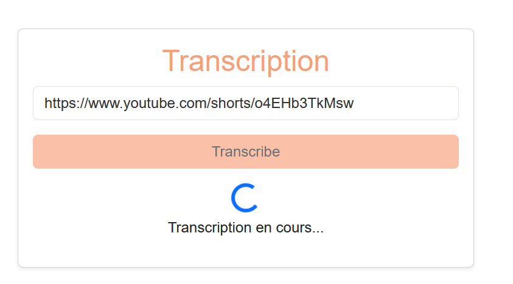
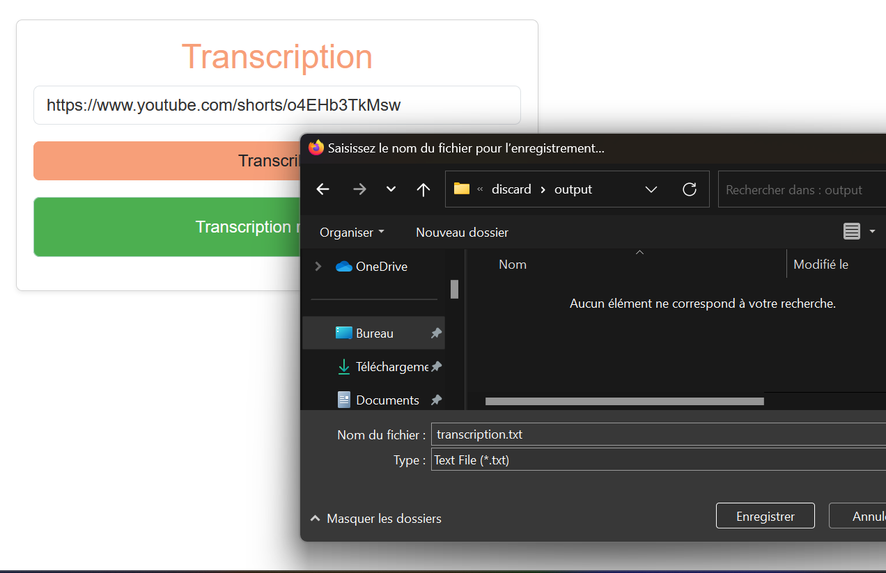

# transcribe-front
## fonctionnel

le projet a pour but de traduire et transcrire des videos sur internet, de et vers des langues differentes.

sources possibles :
- Youtube
- ?





## technique

### Project setup
```
npm install
```

#### Compiles and hot-reloads for development
```
npm run serve
```

#### Compiles and minifies for production
```
npm run build
```

#### Lints and fixes files
```
npm run lint
```

#### Customize configuration
See [Configuration Reference](https://cli.vuejs.org/config/).
